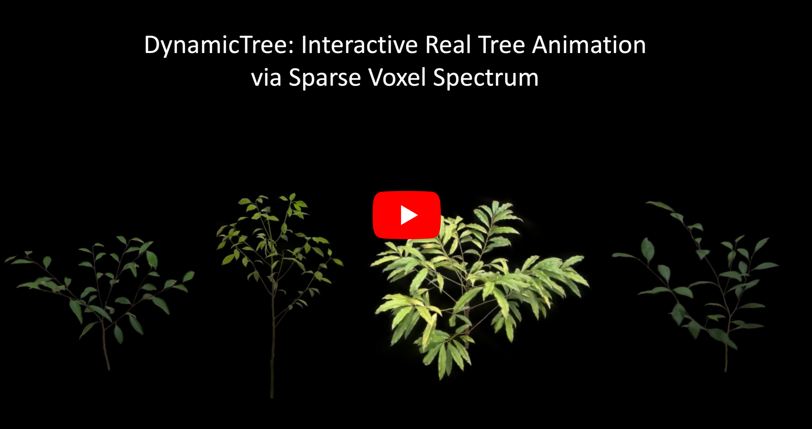

# <div align="center" >DynamicTree: Interactive Real Tree Animation via Sparse Voxel Spectrum<div align="center">
<div align="center">
  <p>
    <a href="https://iron-lyk.github.io/">Yaokun Li</a><sup>1,2</sup>
    <a href="https://dinglihe.github.io/">Lihe Ding</a><sup>2</sup>
    <a href="https://xiao-chen.tech/">Xiao Chen</a><sup>2</sup>
    <a href="https://ise.sysu.edu.cn/teacher/TanGuang">Guang Tan</a><sup>1</sup>
    <a href="https://tianfan.info/">Tianfan Xue</a><sup>2,3</sup>
  </p>
  <p>
    <sup>1</sup>Sun Yat-sen University &nbsp;&nbsp;
    <sup>2</sup>CUHK MMLab<br>
    <sup>3</sup>CPII under InnoHK<br>
  </p>
</div>
 
<p align="center">
  <a href='https://dynamictree-dev.github.io/DynamicTree.github.io/'></a>
  &nbsp;
  <a href='https://www.youtube.com/watch?v=XzFakwy0D1Q'></a>
  &nbsp;
  <a href="https://arxiv.org/abs/2510.22213"></a>
  &nbsp;
  <a href=''></a>
</p>

## 📷 Abstract
Generating dynamic and interactive 3D objects, such as trees, has wide applications in virtual reality, games, and world simulation. Nevertheless, existing methods still face various challenges in generating realistic 4D motion for complex real trees. In this paper, we propose DynamicTree, the first framework that can generate long-term, interactive animation of 3D Gaussian Splatting trees. Unlike prior optimization-based methods, our approach generates dynamics in a fast feed-forward manner. The key success of our approach is the use of a compact <i>sparse voxel spectrum</i> to represent the tree movement. Given a 3D tree from Gaussian Splatting reconstruction, our pipeline first generates mesh motion using the sparse voxel spectrum and then binds Gaussians to deform the mesh. Additionally, the proposed sparse voxel spectrum can also serve as a basis for fast modal analysis under external forces, allowing real-time interactive responses. To train our model, we also introduce 4DTree, the first large-scale synthetic 4D tree dataset containing 8,786 animated tree meshes with semantic labels and 100-frame motion sequences. Extensive experiments demonstrate that our method achieves realistic and responsive tree animations, significantly outperforming existing approaches in both visual quality and computational efficiency.
<div align="center">

[](https://www.youtube.com/watch?v=XzFakwy0D1Q)

</div>

## TODO List
Code and dataset will be made public as soon as possible.
- [ ] Release Training and Inference code.
- [ ] Release Dataset.


## 🔗 Citation
If you find our work helpful, please consider citing:
```
@article{li2025dynamictree,
  title={DynamicTree: Interactive Real Tree Animation via Sparse Voxel Spectrum},
  author={Li, Yaokun and Ding, Lihe and Chen, Xiao and Tan, Guang and Xue, Tianfan},
  journal={arXiv preprint arXiv:2510.22213},
  year={2025}
}
```
